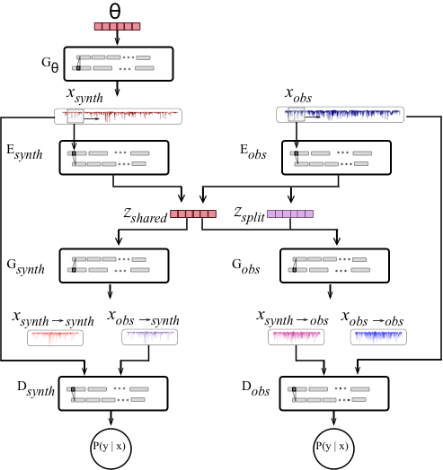

  

# Cycle-StarNet

## Generative and Interpretable Deep Learning for Stellar Spectra

This project aims to bridge the gap between two different sets of stellar spectra. Although the underlying physics that produces the two sets may be the same, the data can visually appear very different for a variety of reasons. The StarNet Cycle-GAN is meant to determine the commonalities between two sets of spectra (ie. the physical parameters) and learn how to transform one set of data into the other. Check out the [technical write-up](./docs/README.md), which explains the method in detail; dicusses the training process; provides insight into issues that may arise when transferring the method to other datasets (as well tricks to fix these issue); and shows some applications of the StarNet Cycle-GAN.

       
   

                               
                                     
    

<b>Figure 1</b>: Overview of the proposed method (left) and a simplified diagram of the StarNet Cycle-GAN Architecture (right).
 
                                   

  

  

<b>Figure 2</b>: Examples of two spectra from opposite domains that have the same stellar parameters. When mapping the synthetic spectrum to the observed domain (top), the resulting spectrum is a much better fit to the observed spectrum, as can be seen in the residual. Similarly, when the observed spectrum is mapped to the synthetic domain (bottom), the resulting spectrum matches the synthetic spectrum well. 
 

## Getting Started ##

This repository takes you through the steps of training and evaluating the StarNET Cycle-GAN. Before going through these steps, I recommend reading the [technical write-up](./docs/README.md) on the method.

  1. First, the model architecture and hyper-parameters are set using the [Setup Architecture Notebook](./Setup_Architecture.ipynb). This creates a configuration file in [the config directory](./architecture_configs) and also a shell script that can be used to run the model on compute-canada that is stored within [the compute canada directory](./compute-canada-goodies).
  
  2. Go to `compute-canada-goodies/python/jobs/todo/`, run the `chmod u+x *` command to make the script executable, then launch the script you created. This will train the cycle-gan, which - with my current set-up - takes about 90 minutes on the GPU. Of course, you will have to be allocated to a GPU within your own terminal. See [here](./compute-canada-goodies) for more information on launching jobs using compute-canada.
  
  3. The [Analysis notebook](./Analysis_turbo.ipynb) takes you through the steps of analyzing the Cycle-GAN.
