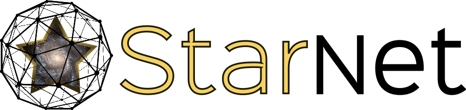
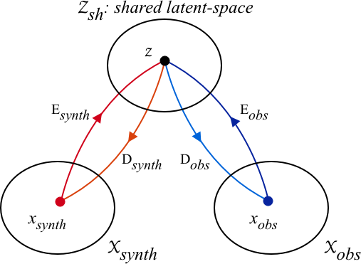
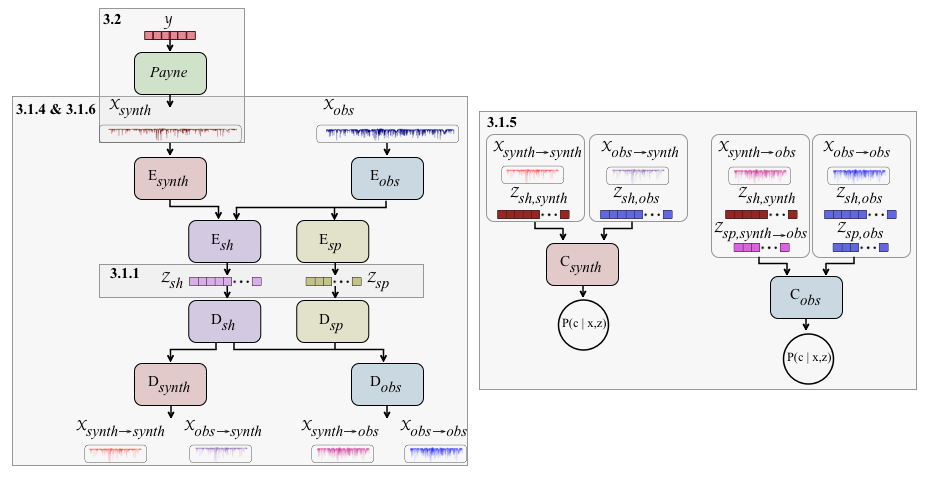
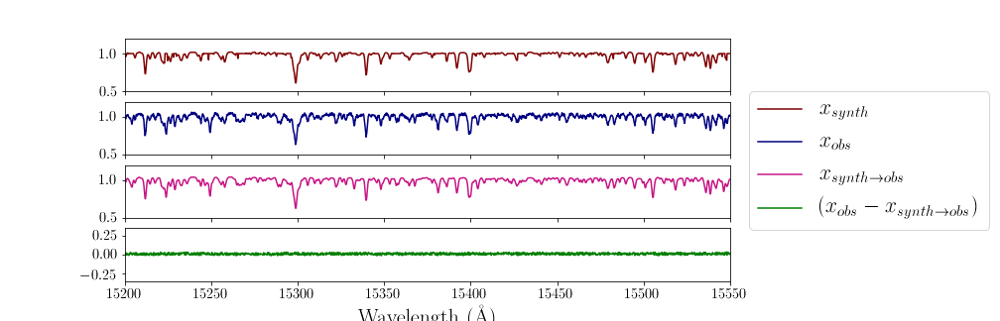

  

# Cycle-StarNet

## Dependencies

-[PyTorch](http://pytorch.org/): `pip install torch torchvision`

-[The Payne](https://github.com/tingyuansen/The_Payne): `pip install The_Payne`

-h5py: `pip install h5py`

-scikit-learn: `pip install -U scikit-learn`

## Generative and Interpretable Deep Learning for Stellar Spectra

This project aims to bridge the gap between two different sets of stellar spectra. Although the underlying physics that produces the two sets may be the same, the data can visually appear very different for a variety of reasons. Cycle-StarNet is meant to determine the commonalities between two sets of spectra (ie. the physical parameters) and learn how to transform one set of data into the other. Check out the [technical write-up](./docs/README.md), which explains the method in detail; dicusses the training process; provides insight into issues that may arise when transferring the method to other datasets (as well tricks to fix these issue); and shows some applications of the Cycle-StarNet.

       
   

                               
                                     
    

<b>Figure 1</b>: Overview of the proposed method (left) and a simplified diagram of the Cycle-StarNet Architecture (right).
 
                                   

  

<b>Figure 2</b>: Examples of two spectra (taken from our New Lines Project) from opposite domains that have the same stellar parameters. When mapping the synthetic spectrum (which has an incomplete line list) to the observed domain, the resulting spectrum is a much better fit to the observed spectrum and the missing information is now present in the transferred spectrum.
 

## Getting Started ##

Before beginning training or utilizing the Cycle-StarNet, I recommend reading the [technical write-up](./docs/README.md) on the method.

To get started with our New Lines Project, take a look [here](./new_lines_project/).
