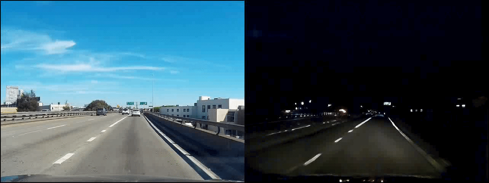
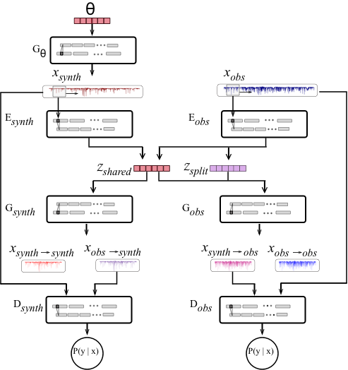
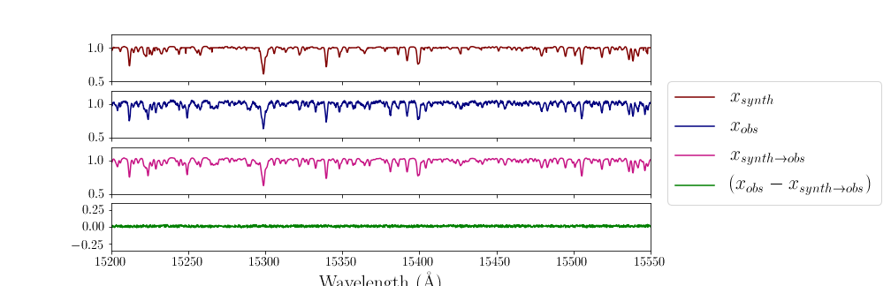

  

# The StarNet Cycle-GAN

## Generative and Interpretable Deep Learning for Stellar Spectra

This project aims to bridge the gap between two different sets of stellar spectra. Although the underlying physics that produces the two sets may be the same, the data can visually appear very different for a variety of reasons. The StarNet Cycle-GAN is meant to determine the commonalities between two sets of spectra (ie. the physical parameters) and learn how to transform one set of data into the other.

### Contents

[The Motivation](#the-motivation)

[Related Work](#related-work)

[Overview](#overview)

[Architecture](#architecture)

[Tasks](#tasks)

   - [Reconstruction](#reconstruction)
   - [Generative Adversarial Process](#generative-adversarial-process)
   - [Cycle-Reconstruction](#cycle-reconstruction)

[The Training Process](#the-training-process)

   - [Batch Training](#batch-training)
   - [Tricks to Train](#tricks-to-train)
   
[Applications](#applications)
      
   - [New Lines Project](#new-lines)
      - [Validation](#validation)   
   
[Getting Started](#getting-started)

## The Motivation

In the initial StarNet Paper:

S. Fabbro, K. Venn, T. O'Briain, S. Bialek, C. Kielty, F. Jahandar, and S. Monty. "An Application of Deep Neural Networks in the Analysis of Stellar Spectra" MNRAS 2017. [[GitHub](https://github.com/astroai/starnet)][[arXiv](https://arxiv.org/abs/1709.09182)]

we applied a Convolutional Neural Network (CNN) to stellar spectra in order to estimate parameters related to a given spectrum. In one application, we trained the CNN on synthetically generated spectra, then attempted to apply this trained model to *real*, observed data. We initially encountered an issue (which is well known in the stellar spectroscopy community) where we found that the synthetic spectra did not match the observed spectra well enough for this model to estimate accurate parameters. This *synthetic gap* was bridged by conducting some pre-processing to both domains of spectra, such as adding noise to the synthetic data and interpolating outliers in the observed spectra. Figure 1 shows a visualization of this, where a t-SNE analysis was computed on the two datasets before and after the pre-processing.

  

 <b>Figure 1</b>: T-SNE analyses to visualize the synthetic gap (left) and the bridging of this gap through data pre-processing (right).
 
  
  For the purposes of our previous work, this method was sufficient to allow us to apply our model - trained on synthetic data - to real, observed data. However, this is not the case for your average dataset because - in most situations - the synthetic spectra have not been modified a priori to match the observations. For instance, the observations will contain noise and instrumental features that are difficult to model in the synthetic spectra. Not only this, but there are physical features in spectra that we can not model perfectly in our synthetic generation, as well as information (ie. underlying physics) that is not completely understood (see Figure 2).

  
  This gives rise to the motivation for the StarNet Cycle-GAN, where we aim to let a Neural Network (NN) *learn* the similarities and differences between two datasets (referred to as domains), and hence, the transformation from one domain to the other.

## Related Work

The method we have adopted for this work is based off of the project:

M. Liu, T. Breuel, J. Kautz, "Unsupervised Image-to-Image Translation Networks" NIPS 2017. [[GitHub](https://github.com/mingyuliutw/UNIT)][[arXiv](https://arxiv.org/abs/1703.00848)]

where Liu et al. created a network that learned to transfer images - in an unsupervised fashion - from one domain to another. Figure 3 shows an example of this where the network was trained to transfer between (i) snowy and summer domains and (ii) day-time and night-time iamges. Once the model is trained, it can take an image from one domain and transfer that same scene to the opposite domain; recreating the same image but in the setting of the other dataset.

       
  

 <b>Figure 3</b>: Domain transfer from snowy domain to summer domain (left two images) and from day time domain to night time domain (right two images). Once trained, the network can take the left image of the pair and produce that same image, but in the opposite domain (the right image of each pair).
 

We would like to apply this same domain transfer, but to stellar spectra. For example, one domain could be synthetically generated spectra, while the other is observed spectra obtained from a telescope. One of the greatest strengths of this method for domain transfer is that they do not require known paired samples in each domain. This is ideal for our application to stellar spectra, as we do not expect to know the physical parameters that describe the stars which we observe before applying the Cycle-GAN.

## Overview

As mentioned, the main motivation for this project is to bridge the gap between synthetic spectra and observed spectra that have been obtained from a telescope. Currently, there are quite a few methods to generate a synthetic spectrum with a given set of physical parameters. These synthetic spectra represent - to our best understanding - what real spectra *should* look like if they were to have a given set of characteristics (ie. temperature, surface gravity, chemical composition, etc.). Therefore, we know how to translate stellar parameters, &Theta;, to synthetic spectra, &Chi;synth. What we want to do is to *learn* how to translate synthetic spectra to observed spectra, &Chi;obs, and hence, create a mapping from &Theta; to &Chi;obs (Figure 4). 

We can assume that we have two separate domains of spectra that exist in separate spaces, we want to create a shared space for these two domains to be transferred into, called the *shared latent-space*. Once we have accomplished this, we can map spectra from one domain to the other by transferring the spectra into the shared space first.

  

<b>Figure 5</b>: Diagram of the proposed method.
 

## Architecture

Creating this shared-latent space is not trivial, and therefore, our method requires several different subnetworks that are trained to achieve multiple [tasks](#tasks). The StarNet Cycle-GAN consists of 7 subnetworks, the first of which is the **synthetic emulator**, *G*&theta;, that takes a set of stellar parameters as its input and produces a synthetic spectrum. We have modelled the synthetic emulator with a NN that has been trained on spectra generated from stellar models and comprehensive line lists. Using a NN in place of the original synthesizer has a few advantages: (i) the NN is much more efficient to generate spectra on the fly and (ii) the NN is easily differentiable, which is important when [estimating stellar parameters](#estimating-stellar-parameters). This synthetic emulator is the only subnetwork that is trained separately from the remaining 6 subnetworks and is not the main focus of this project.

  

<b>Figure 6</b>: A simplified diagram of the StarNet Cycle-GAN Architecture.
 

The remaining architecture consists of two encoders, two generators, and two discrimnators. **The encoders**, *E*synth and *E*obs, take spectra from their respective domains and map them to the 
*latent-space*. We have actually split the latent-space to consist of shared latent variables, *Z*shared, that are common to both domains, and split latent variables, *Z*split, which represents information that is unique to the observed domain. The motivation for using the split latent variables in addition to the shared ones is that we know that the synthetic spectra can be described by a fixed set of variables and this information is also present in the observed spectra. However, two stars (in the observed domain) can have the same set of stellar parameters, &theta; (which have been used to produce our synthetic domain), yet vary in other important characteristics. Without separating the latent-space, this information would be lost once the spectra were mapped to the synthetic domain, making the [cycle-reconstruction](#cycle-reconstruction) impossible. Not only this, but the shared latent-space assumption would no longer be valid, because the model would try to imprint this information somewhere in the latent-space that is common between the two domains, yet we know that it would not be meaningful for the synthetic domain, and therefore, the latent representations for corresponding spectra in opposite domains would not be the same.

It may be tempting to impose a constraint on the shared latent-variables to have them represent the original stellar parameters used to produce the synthetic spectra, however, this idea has been attempted several times to no avail. We have found that imposing such a constraint works for dealing with one domain of spectra, but does not produce logical results when used to extract information from another (dissimilar) domain. That being said, this work is still experimental and we encourage others to try different ideas using this general framework.

The **generators**, *G*synth and *G*obs, take the latent-representations as inputs and generate spectra into their respective domains. Of course, *G*synth only requires the shared latent-variables, while *G*obs takes both the shared *and* split latent-variables as inputs. Combinining all 4 subnetworks (*E*synth, *E*obs, *G*synth, and *G*obs) we have created domain mappings: (i) synthetic to synthetic (&Chi;synth->synth), (ii) observed to observed (&Chi;obs->obs), (iii) synthetic to observed (&Chi;synth->obs), (iv) and observed to synthetic (&Chi;obs->synth).

However, in order for the cross-domain mappings to be *learned*, we need to use two **discriminators**, one for each domain. These discriminators learn to discern between spectra that truly belong in that domain (&Chi;obs, for instance) and spectra that have been cross-domain generated (&Chi;synth->obs in this example). These discriminators are used to accomplish the [generative adversarial process](#generative-adversarial-process) during training.

## Tasks

The training of the StarNet Cycle-GAN requires accomplishing several different tasks, which are outlined here.

### Reconstruction

The first task is very simple, it is solely the reconstruction of both synthetic and observed spectra. Namely, synthetic spectra are mapped to the latent-space, then back to the synthetic domain (&Chi;synth->synth = *G*synth(*E*synth(&Chi;synth))) and must accurately reconstruct the original synthetic spectra. This same process is undergone for the observed spectra where &Chi;obs->obs = *G*obs(*E*obs(&Chi;obs)) must accurately reconstruct &Chi;obs. This is accomplished by comparing the output spectra to the inputs through a mean-squared-error loss function.

  

<b>Figure 10</b>: The reconstruction task. 
 

### Generative Adversarial Process

The next task is the generative adversarial process where the cross-domained mappings are learned by utilizing the discriminators. In general, generative adversarial learning is accomplished through the use of a generator and a discriminator, where the discriminator is trained to differentiate between "real" and "fake" (or generated) samples. While the discriminator is improving its ability to make this discernment, the generator is being trained to produce samples that fool the discriminator. Therefore, as the generator creates more "real-like" samples, the discriminator becomes a better teacher, forcing the generator to produce even better samples; as both models continue to improve, their corresponding tasks become more and more difficult. This back-and-forth process is the essence of adversarial learning.

For the purposes of the StarNet Cycle-GAN, there is one discriminator for each domain and the generators in this case are the cross-domain encoder-generator pairs. Therefore, *D*synth takes "real" spectra, &Chi;synth, and "fake" spectra &Chi;obs->synth, as inputs and predicts a probability of which class each spectrum belongs to: 1 for real and 0 for fake. These predictions are evaluated using a binary cross-entropy loss, which is only back-propagated through the discriminator. This ensures that the loss does not impact the generation process, only the discriminator's ability to differentiate between real and fake samples. This process is replicated for *D*obs  using &Chi;obs as the real samples and &Chi;synth->obs as the fake samples.

To make this process more robust, the discriminators actually take pairs of spectra and latent representations as inputs (as seen in the diagrams of Figure 9). This ensures that, not only do the generated spectra look as though they belong in their associated domains, but also that the latent representations for those spectra are similar to those associated with the "real" spectra.

As mentioned, the tasks for the generator functions *G*synth(*E*obs(&Chi;obs)) and *G*obs(*E*synth(&Chi;synth)) are to fool the discriminators *D*synth and *D*obs, respectively. Therefore, the adversarial objectives for the generator processes is to maximize the two losses evaluated on the disciminator outputs, and to accomplish this, the target class is simply switched (fake=1) when the loss is back-propagated through *G*synth(*E*obs(&Chi;obs)) and *G*obs(*E*synth(&Chi;synth)). These losses are back-propagated through the cross-domain encoder-generator pairs to improve their ability to produce more "real-like" spectra.

  

<b>Figure 11</b>: The generative adversarial task.
 

### Cycle-Reconstruction

Accomplishing the aforementioned [reconstruction task](#reconstruction) and [generative adversarial process](#generative-adversarial-process) would result in having a model that is able to map from synthetic to synthetic, observed to observed, and generate spectra from synthetic that look as though they belong in the observed domain, as well as generate spectra from observed that look as though they belong in the synethetic domain. However, there is no guarantee that for a given spectrum, &Chi;synth, the cross-domain generated spectrum, &Chi;synth->obs, is the correct corresponding spectrum in the observed domain. Therefore, we impose the cycle-consistency constraint. This constraint enforces that when &Chi;synth is mapped to &Chi;synth->obs, this observed representation must be mapped back to the synthetic domain, &Chi;synth->obs->synth and accurately reconstruct &Chi;synth. This constraint impies that all of the information contained in the original spectrum, &Chi;obs, is also contained in its observed represenation, &Chi;synth->obs. Of course, this cycle-consistency constraint is also applied to the observed domain. Along with the generative adversarial process, this ensures that a pair of corresponding spectra from the two domains will be mapped to the same latent representation.

To implement this constraint, two additional reconstruction losses are applied to *G*synth(*E*obs(*G*obs(*E*synth(&Chi;synth)))) and *G*obs(*E*synth(*G*synth(*E*obs(&Chi;obs)))). These cycle-consistency losses are back-propagated through the four models (*E*synth, *E*obs, *G*synth, and *G*obs).

  

<b>Figure 12</b>: The cycle-reconstruction of a synthetic spectrum. This same process is undergone for the observed spectra.
 

## The Training Process

### Batch training

The training of the StarNet Cycle-GAN is done in batches, where a batch of observed and synthetic spectra obtained. These two batches are mapped to the opposite domains and sent through the two discriminators to compute a training iteration on both discriminators. When the observed spectra are mapped to the latent-space, both the shared and split latent variables are produce, while the synthetic mapping to the latent-space only produces the shared latent variables. The split latent variables from the observed domain include information that is not present in the observed domain, and are therefore necessary to produce “real-like” spectra through *E*obs. For this reason, the split latent variables from the observed batch are used along with the shared latent variables from the synthetic batch when generating &Chi;synth->obs.

Next, the same batches are used to compute a training iteration on the encoders and generators by simultaneously evaluating the reconstruction, cycle-reconstruction, and generative losses. As mentioned previously, the additional information contained in the split latent variables is lost once the observed spectra are mapped to the synthetic domain, but this information is necessary to cycle-reconstruct these spectra. Therefore, the split latent variables produced by the original encoding of the observed spectra are held on to in order to cycle-reconstruct the observed spectra from the synthetic domain.

### Tricks to train

Training a GAN is not as straightforward as your typical regression or classification task, because the performance of the generator depends on the current quality of the discriminator and vice-versa. This means that even if the discriminator is able to predict true vs. false with, say, a 95% accuracy, the generator may still be producing quality results. At the same time, if the generator is able to fool the discriminator half of the time, it does not necessarily imply that it is doing a good job of producing “real-like” spectra; the discriminator may just be ineffective at its own task. The bottom line is that it is difficult to evaluate the performance of a GAN based on the loss and/or standard metrics. This issue is magnified in the Cycle-GAN because there are many simultaneous tasks that the model is trying to achieve. Having said that - after training many different architectures - I have discovered a few methods to determine if the model is training ~ok or not. Note that these are by no means strict rules to go by, nor are they generally applicable to all GANs.

The trick is to **have the discriminator provide useful gradients for the generator to learn from**. This means that we do not want the discriminator getting too strong too quickly, nor do we want the discriminator to get stuck and not improve ahead of the generation process; becoming an ineffective *teacher*. Therefore, I have found that **the most important hyper-parameters for the StarNet Cycle-GAN are the loss weights**. Each loss (reconstruction, cycle-reconstruction, generation, etc.) is assigned a loss weight when compiling the model. These loss weights determine how much the training of the model will focus on a given loss. I have actually found that the reconstruction and cycle-reconstruction loss weights need to be much higher than the generation loss weights. This has been found to give a smoother training process, however, the relative weights can not be made too extreme or else the discriminator learns much quicker with respect to the generation process and the model suffers from the vanishing gradient problem (which is well documented in GAN literature). This can be seen when the one or both of the generator losses gets stuck at a high value (~16 in my case). Similarly, if the reconstruction weights are too low, the gradient will vanish again at the lower end. Therefore, if tuning the hyper-parameters, I suggest first focusing on the loss weights and optimizing these for *each* change you make to the architecture.

I expect that **the size of the shared latent-space and the split latent-space are also important hyper-parameters**, though this importance is mitigated somewhat by including the latent variables as additional inputs to the discriminators. By doing so, the network must encode the same information when mapping synthetic and observed spectra to the shared latent-space and also encode the same information in the split latent space when encoding the observed spectra and creating *Z*split, synth = *E*obs(*G*obs(*E*synth(&Chi;synth), *Z*split, obs)). This allows some leniency in the size of the split latent-space, which is the more dangerous of the two because we do not want the observed domain encoding the majority of its information here.

**Another very important aspect of training is the distribution of your "synthetic" dataset.** I have found that the model only trains well if your synthetic and observed datasets come from a similar distribution (ie. have similar stellar parameters). When training with two synthetic datasets, this is easily accomplished because we know the distribution beforehand, however, that will not be the case when applied to *real* data. This is one of the aspects that I am currently working on. A possible solution is to - during training - create a larger batch of synthetic spectra than observed spectra, but only use the *best* synthetic spectra for training. For instance, say we grab a batch of 8 observed spectra and then generate (from a uniform distribution of stellar parameters) a batch of 32 synthetic spectra. Before training on these spectra, we map the synthetic spectra to the observed domain, and then use the discriminator to predict whether or not these spectra look as though the belong in the observed domain. By selecting and training on the 8 synthetic spectra that fool the discriminator best (ie. produce the most "observed-like" spectra), we will effectively overlap the distributions of our two datasets during training.

These difficulties are the main limitation of this method and likely make the model – in its current – state, not readily transferrable to different datasets. However, by optimizing the loss weights and the size of the latent-space, a solid starting point to work from should be attainable. The best way that I have found to evaluate the training of the model is to use a [cross-validation set](#cross-validation), which consists of spectra from both domains that you are confident have the same (or similar) stellar parameters. Throughout training, you can evaluate how well the cycle-gan generates spectra from one domain to the other by directly comparing, for example, &Chi;synth->obs to &Chi;obs in the cross-validation set. You can also compare the latent representations of both sets to ensure that both encoders are producing similar information. This is done in the example provided where a cross-validation set is evaluated upon each checkpoint.

## Applications

### New Lines

Using the Payne to generate spectra with a complete line list (the observed domain) and another Payne to generate spectra with some of these lines masked (the synthetic domain), we can train a cycle-gan to learn the transformation from one to the other and then differentiate the &Theta; to &Chi;obs mapping to determine which stellar parameter effects the *unkown* lines

#### Code

  - [Model configuration file](../architecture_configs/cycgan_2.ini)
  - [Shell script](../compute-canada-goodies/python/jobs/todo/cycgan_2.sh) to launch the training
  - [Training python script](../train_cycgan_payne.py) for training the cycle-gan
  - [Analysis notebook](../Analysis_payne.ipynb) to evaluate the trained model
  
  
#### Validation

The great aspect of using two domains of spectra for which we know the stellar parameters a priori is that we can evaluate our method's ability to generate spectra by comparing matching spectra directly. This was done by generating a small cross-validation set of ~800 spectra that have the same stellar parameters and evaluating them throughout training. By analyzing the performance on the cross-validation set, selecting a good model architecture and set of hyper-parameters is doable. Knowing the stellar parameters beforehand is necessary for this, which isn't the case when dealing with an *actual* observed dataset. However, it may make sense to use a small subset of benchmark stars as the cross-validation set in this case. Note that the model is not actually trained on these spectra, but only evaluated to determine the best model.

The bottom right plot of Figure 13 shows the evaluation of our TURBOSPEC cross-validation set throughout training, where the generated spectra are compared to the original spectra using a mean-squared-error metric, which are the &Chi;synth->obs and &Chi;obs->synth scores. The four Z scores shown are the evaluations on the latent-representations. I have found that using a mean-squared-error or relative error metric is not sufficient because the model is free to scale the latent variables as it chooses, therefore, I have decided upon another metric to use:

For instance, we want both encoders to output the same information into the shared latent-variables. In order to evaluate if this is true, we can map, for example, &Chi;synth to *Z*synth,shared, then also map &Chi;synth->obs to *Z*synth->obs,shared and compare these to eachother. But to evaluate them using, say, a mean-squared-error metric or relative error may give decieving results.

To illustrate this problem, take two spectra from opposite domains that have the same stellar parameters and lets pretend that the latent space is only one variable. Say that *Z*1,synth,shared = 0.7 and *Z*1,obs,shared = 0.72. This looks like they are pretty close and the percentage error is quite small. But now I go and look at another pair of spectra that differ from these original ones and find that *Z*2,synth,shared = 0.71 and *Z*2,obs,shared = 0.725. The model has made it so that all of the spectra differ very slightly from each other in the *Z* domain so that the MSE loss is low, but small variations are actually very important to the model. In other words, pairs of spectra from opposite domains have similar latent representations relative to eachother but also similar relative to the rest of the dataset.

Therefore, we take the cross-validation set, normalize each latent variable across the entire set between 0 and 1, then compare the two using a mean-absolute-difference. This way the relative difference between a single sample and between the entire set is taken into account. We can evaluate this metric on *Z*synth,shared vs. *Z*synth->obs,shared; *Z*obs,shared vs. *Z*obs->synth,shared; *Z*obs,split vs. *Z*synth->obs,split; and *Z*synth,shared vs. *Z*obs,shared. These are the four *Z* scores noted in the bottom right of Figure 13.

Combining these 4 *Z* scores with the 2 &Chi; scores - all evaluated on the cross-validation set - is the best method that I have found to evaluate the training of the model.

  

<b>Figure 13</b>: The training progress of the StarNet Cycle-GAN.
 

Using the trianing process above, we have built a model that succesfully learns the translation from one domain to the other. To exemplify this ability, figures 14 and 15 show examples of cross-domain mapped spectra compared to corresponding spectra in the opposite domains.

  

<b>Figure 14</b>: An example of two spectra from opposite domains that have the same stellar parameters. When mapping the synthetic spectrum to the observed domain, the resulting spectrum is a much better fit to the observed spectrum, as can be seen in the residual. 
 
  
To show this further, t-SNE analyses were conducted on both the spectra and the shared latent-represenations of our cross-validation set in Figure 16. The top right plot shows a comparison of the original spectra. Even though the spectra have the same stellar parameters and occupy the same wavelength region, there is clearly a gap between the two. However, when these spectra are mapped to the opposite domains and compared to the original spectra (the middle row of Figure 16), the match is much better. This is accomplished through building a shared latent-space, which is exemplified in the top right plot. The bottom two plots are the cycle-reconstructed spectra compared to the original spectra.

  

<b>Figure 16</b>: t-SNE analyses on the cross-validation set. 
 

### The Payne to *actual* observed data (maybe DR14 or DR15?)

## Future Considerations

### Continuum

### Telluric Lines

## Current Issues

Instability of training

Parameter distribution.
